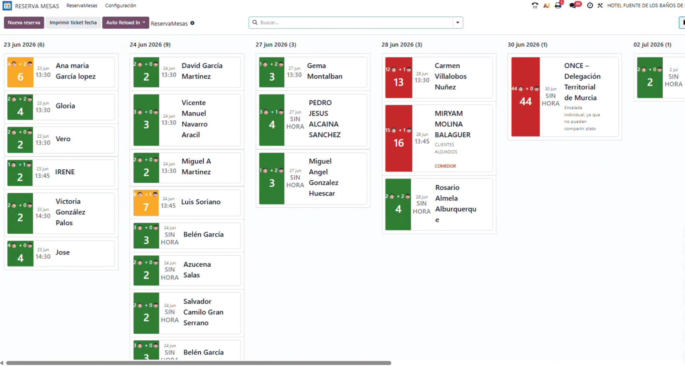
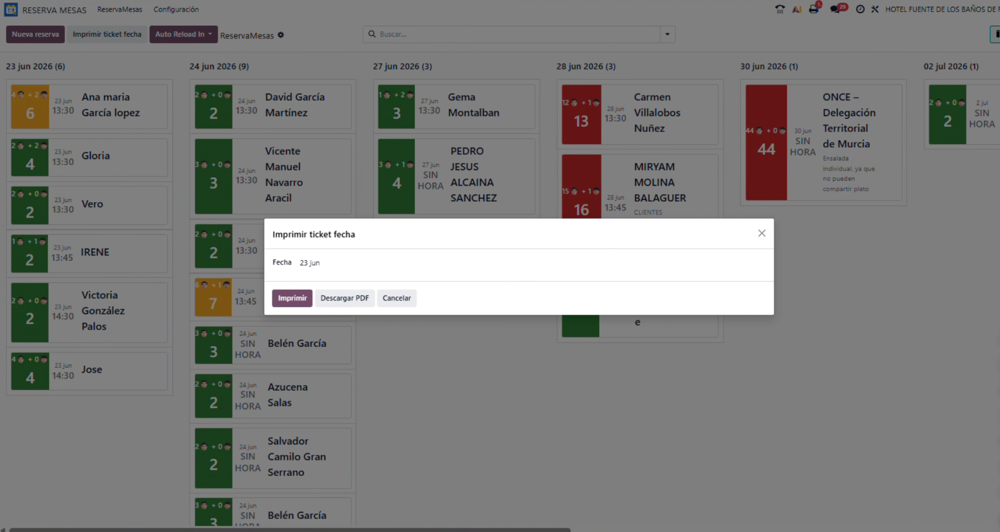
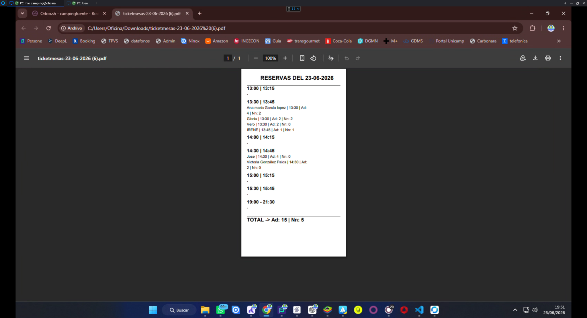
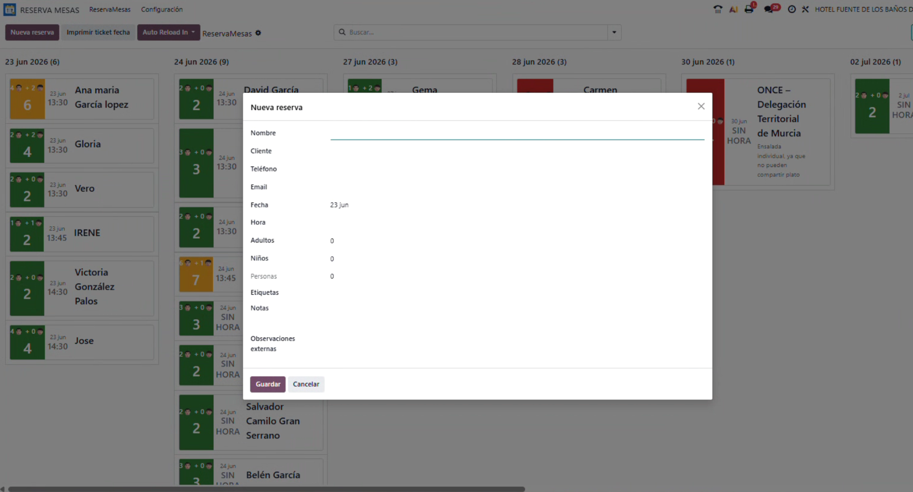

# Odoo Restaurant Table Reservation

**Odoo Restaurant Table Reservation** is an Odoo 19 addon for managing restaurant table reservations from a visual Kanban board, with reservation tags, quick creation wizards, daily kitchen/service tickets and optional integrations with POS tickets, sales orders and external reservation flows.

This addon was created and stabilized from a real production use case at **Camping Fuente**. The Camping Fuente deployment is used as the reference case, but the module is published as a reusable restaurant table reservation addon.

- **Technical addon name:** `odoo_restaurant_table_reservation`
- **Repository name:** `odoo_restaurant_table_reservation`
- **Author:** RayTugah
- **License:** LGPL-3
- **Odoo version:** 19.0

---

## Screenshots

The following screenshots show the main frontend workflow of the module. Replace these files with your own screenshots if you adapt the module to another business.

<p align="center">
  <a href="#screenshot-1--kanban-reservation-board">1. Kanban</a> ·
  <a href="#screenshot-2--print-ticket-by-date">2. Print ticket</a> ·
  <a href="#screenshot-3--daily-ticket-pdf">3. PDF ticket</a> ·
  <a href="#screenshot-4--new-reservation-wizard">4. New reservation</a>
</p>

### Screenshot 1 — Kanban reservation board



### Screenshot 2 — Print ticket by date



### Screenshot 3 — Daily ticket PDF



### Screenshot 4 — New reservation wizard



---

## Main purpose

The module centralizes restaurant table reservations in a dedicated Odoo application. It is designed for environments where reservations may come from different operational sources, such as direct manual bookings, restaurant staff, sales orders, POS tickets, pool/day-pass reservations or migrated records from an earlier Studio implementation.

The module helps the team answer questions such as:

- Which reservations do we have today?
- At what time is each table or group arriving?
- How many adults and children are expected?
- Which reservations require special attention?
- Which reservations are linked to POS tickets or external services?
- What should be printed for kitchen or restaurant service preparation?

---

## Key features

### Visual Kanban board

Reservations are displayed in a grouped Kanban layout, usually grouped by reservation date. Each card highlights the most relevant operational information:

- Reservation date and time.
- Customer or reservation name.
- Number of adults.
- Number of children.
- Total number of people.
- Visual color indicators based on party size.
- Tags for special situations or areas.
- Internal and external observations.

This view is especially useful for restaurant staff because it gives a fast overview of the day and upcoming service dates.

### Reservation form

Each table reservation can store:

- Customer/contact.
- Phone number.
- Email.
- Reservation date.
- Reservation time.
- Adults.
- Children.
- Total people.
- Internal notes.
- External observations.
- Tags.
- Linked sales order.
- Linked POS ticket.
- Linked pool/day reservation, when available in the database.

### Quick reservation wizard

The module includes a quick creation wizard for adding new reservations from the Kanban screen. The wizard lets the user create reservations without opening the full technical form.

Typical fields shown in the wizard are:

- Name.
- Customer.
- Phone.
- Email.
- Date.
- Time.
- Adults.
- Children.
- Tags.
- Notes.
- External observations.

### Reservation tags

Tags are used to mark relevant operational information. In the Camping Fuente use case, tags are used for information such as:

- Dogs.
- Accessibility.
- Babies or children.
- Food-related notes.
- Specific areas such as dining room, bar, terrace or social room.
- Take-away orders.
- Groups or special events.
- Service shift indicators.

The module creates default tags during installation to reproduce the stable production behavior of the reference implementation.

### Daily TicketMesas report

The module includes an independent QWeb PDF report for printing a daily reservation ticket. This report is integrated into the addon and works directly with the module's reservation model.

The report groups reservations by time slots, for example:

- 13:00 / 13:15
- 13:30 / 13:45
- 14:00 / 14:15
- 14:30 / 14:45
- 15:00 / 15:15
- 15:30 / 15:45
- 19:00 / 21:30

For each reservation it prints the name, time, adults and children. At the bottom it prints daily totals for adults and children.

The report uses a thermal-ticket style paper format:

- Width: 80 mm.
- Height: 297 mm.
- Portrait orientation.
- Zero margins.
- DPI 110.

### Print ticket by date wizard

The module includes a wizard to print reservations for a selected date. The workflow is:

1. The user clicks **Print ticket by date**.
2. A date is selected.
3. The module searches reservations for that date.
4. The TicketMesas report is generated for those reservations.
5. The PDF can be printed or used with the configured printing system.

### Optional Direct Print / workstation usage

The module provides the Odoo report needed for printing. If the database uses Direct Print, PrintNode, an IoT box or a workstation print system, the new report must be configured in that external printing system in the same way as any other Odoo report.

The report included in the module is independent and does not depend on the original Studio report from the Camping Fuente use case.

### POS ticket synchronization

The module can keep restaurant reservations linked to existing POS ticket records when the target database has the required model and fields.

In the Camping Fuente case, this was used to keep the POS ticket updated with:

- Contact phone.
- Linked table reservation.
- Group date.
- Number of people.

This behavior is useful when POS tickets are used for kitchen, billing or service coordination.

### Optional pool/day reservation integration

The Camping Fuente use case includes a pool reservation workflow where some pool products include a restaurant table. When those optional fields and models exist, automated actions can create, update or remove a linked table reservation depending on the selected product and reservation status.

Typical logic:

- Product with table → create or update table reservation.
- Product without table → remove linked table reservation.
- Cancelled pool reservation → remove linked table reservation.

This integration is optional and may need field adaptation in other databases.

---

## Technical models

The module uses independent technical models instead of relying on Odoo Studio models.

Main model:

```text
x_camping_reservamesas
```

Tag model:

```text
x_camping_reservamesas_tag
```

Ticket-related helper models may also be present depending on the version and optional integrations.

The technical names keep compatibility with the original stable use case, but the addon itself is now distributed as a generic restaurant table reservation module.

---

## Installation

Copy the addon folder directly into your Odoo addons path:

```text
odoo_restaurant_table_reservation/
├── __manifest__.py
├── __init__.py
├── models/
├── views/
├── data/
├── security/
├── controllers/
├── static/
├── docs/
├── README.md
├── LICENSE
└── AUTHORS.md
```

Then update the Odoo app list and install:

```text
Restaurant Table Reservation
```

For Odoo.sh, add this repository to your branch and update the app list after the build is complete.

---

## Dependencies

The manifest includes dependencies used by the reference production implementation:

- `base`
- `web`
- `mail`
- `base_automation`
- `calendar`
- `contacts`
- `product`
- `sale`
- `pos_restaurant`
- `pool_reservation_capacity`

If you want to reuse the module in another installation, review the dependencies and optional integrations according to your database.

---

## Configuration after installation

After installing the module:

1. Open the **Restaurant Table Reservation** app.
2. Review the default tags.
3. Create a test reservation.
4. Check the Kanban grouping and colors.
5. Test the quick reservation wizard.
6. Test the TicketMesas daily report.
7. Configure your printing system if you use Direct Print, PrintNode, IoT or a workstation printer.

---

## Migration from an Odoo Studio implementation

The module includes helper logic for installations that previously used an Odoo Studio model for table reservations.

The reference migration copies reservations from the old Studio model to the new independent model and preserves compatible field values and tags where possible.

Example shell usage:

```python
env['camping.reservamesas.setup'].sudo().migrate_from_studio()
env.cr.commit()
```

The migration is designed to avoid duplicating already migrated records by using internal migration identifiers.

Before using migration helpers in production, always test them in a staging database and keep a backup.

---

## Printing notes

The module includes its own independent TicketMesas report. If you are replacing a Studio implementation, make sure your print system is configured for the new report, not only for the old Studio report.

New report example:

```text
Report model: x_camping_reservamesas
Report type: qweb-pdf
Paper format: TICKETS ReservaMesas
```

If the PDF downloads correctly but does not print automatically, configure your Direct Print / PrintNode / IoT / workstation rules for this new report.

---

## Repository layout

This repository is intentionally flat: the Odoo addon is located directly at the repository root.

```text
odoo_restaurant_table_reservation/
├── __manifest__.py
├── __init__.py
├── models/
├── views/
├── data/
├── security/
├── controllers/
├── static/
├── docs/
├── README.md
├── LICENSE
└── AUTHORS.md
```

There is no additional nested addon folder.

---

## Case study: Camping Fuente

Camping Fuente is the reference production use case for this addon. The module was created to replace and stabilize a previous Odoo Studio implementation used for restaurant reservations, daily reservation tickets and operational coordination between restaurant, pool/day-pass reservations and POS tickets.

The addon is published as a reusable module, but some technical field names remain close to the reference implementation to preserve migration safety and operational compatibility.

---

## Roadmap

Possible future improvements:

- More generic model names for broader public reuse.
- Configurable time-slot groups for the daily ticket report.
- Optional restaurant floor/table map integration.
- Public website reservation form.
- Calendar view improvements.
- More generic optional integration hooks for POS and external reservation systems.

---

## Author

Developed by **RayTugah**.

Reference use case: **Camping Fuente**.

---

## License

This project is licensed under the **LGPL-3** license.

See [LICENSE](LICENSE) for details.
